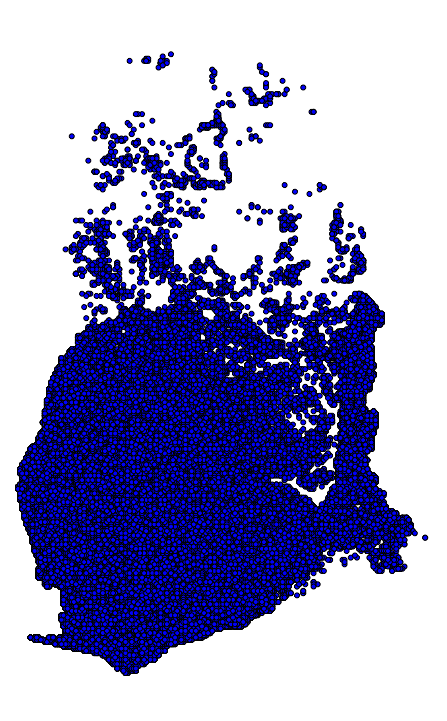

## Spark GeoJSON Clip Example

#### Overview
Clipping & processing million's or even billions of points can take days,weeks, (never finish) aka a long time with traditional GIS methods using GUI software, or your typical 1 core python process.

This is an example of how you can use python with spark & shapely to clip BIG DATA in minutes. I processed 720,607,428 records on a 8 core 15GB of RAM laptop in about 10 minutes, this would be even faster with a cluster.

We tried to do a comparative analysis with a Desktop software (left to be un-named). Its still running with no end in site ;)

#### Keep in mind
The data projects of the GeoJSON and the CSV must be in the same geographic units

#### Install Requirements
 - [spark](https://spark.apache.org/)
 - [shapely](https://github.com/Toblerity/Shapely)

### Input Parameters
    INPUT_FILE = './data/sample-data.csv' # File with points, see sample-data.csv
    OUTPUT_DIR = './data/output' # Output directory (spark will create)
    GEOJSON_FILE = './data/GHA.geojson' # Location of GeoJSON File

In the GeoJSON there are properties values which are used to identify the different features in the GeoJSON. In our case we only have 1 however, you could expand the functionality to loop through all features and clip each one.

    "features": [
    {
      "type": "Feature",
      "properties": {
        "ISO": "GHA",
        "Name": "Ghana"
      },
      "geometry": {
        "type": "MultiPolygon",
        "coordinates": [
          [
            [
              [
                -226581.46020832963,
                528968.4938387548
              ],

I used the ISO field to identity the feature. These can be specified by setting input parameters.

    GEOJSON_PROPERTY_KEY = 'ISO'
    GEOJSON_PROPERTY_VALUE = 'GHA'

### Custom Row Parsing

Your CSV may have a different order, you may need to change which columns to use for x,y

      # line 14 in spark-clip.py
      p = Point(float(row[1]), float(row[2]))

### Start Spark

     ~/directory-to-spark/sbin/start-all.sh

### Submit a spark job

Change IP to your spark environment

    #!/usr/bin/env bash
    /Users/jnordling/projects/spark-1.4/bin/spark-submit\
     --master spark://192.168.1.10:7077\
     --executor-memory 10G\
     /Users/jnordling/point-poly/spark-clip.py

### Output files
Spark will produce its output in plan text files labeled starting with 'part'. These files can be found in the output directory.

To turn these part files into one file you can run something like

    cd ~/point-poly/data/output/ # Change directory
    cat part* > clipped-points.csv

